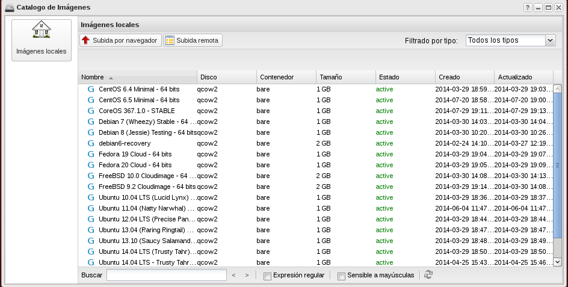
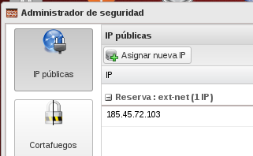
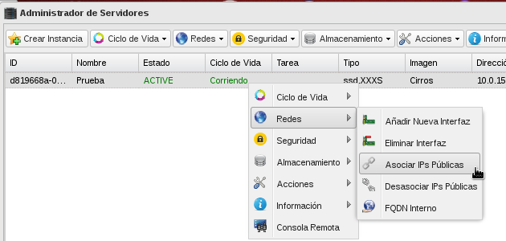
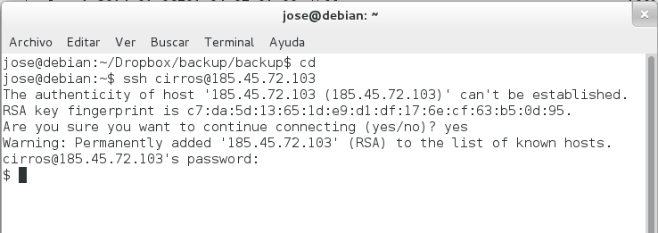

## Demostración 1: Trabajar con imagen e instancia Cirros

La primera demostración que vamos a realizar es la creación de una instancia a partir de una imagen de un sistema operativo CirrOS. **CirrOS** es una distribución mínima de Linux que ha sido diseñada para su uso como imagen de prueba en las infraestructuras de cloud construidas con Open Stack. Los pasos que vamos a dar son los siguientes:

1. Bajamos una imagen CirrOS de la página [Get images - Openstack](http://docs.openstack.org/image-guide/content/ch_obtaining_images.html), o ejecutamos el siguiente comando:

		$ wget http://download.cirros-cloud.net/0.3.3/cirros-0.3.3-x86_64-disk.img

2. Accedemos a StackOps Portal, y entramos en la opción **Catálogo de Imágenes**:

	

3. Ahora tenemos dos opciones para subir una nueva imagen: **Subida por navegador** (en el que podemos subir imágenes que tengamos almacenadas en nuestro ordenador) o **Subida remota** (subimos imágenes indicando la url donde se encuentra la imagen). Podríamos utilizar cualquier método, pero en este ejemplo vamos a usar la **Subida por navegador**, donde vamos a indicar los siguientes datos:
	
    * Nombre : Nombre que asignaremos a la nueva imagen.
    * Fichero de Imagen : Indicamos el path completo del fichero donde está la imagen.
	* Formato de disco : Seleccionamos el formato de la imagen. Los formatos soportados son :
        * qcow2 : Soportado por el emulador QEMU que puede expandirse de forma dinámica y soportar copiar al escribir (copy-on-write).
        * raw : Un formato de imagen de disco desestructurado, si se tiene un fichero sin extensión entonces probablemente se trate de un formato raw.
        * iso : Un formato de archivo para datos contenidos en un disco óptico, como por ejemplo un CD-ROM.
        * vmdk : Formato de disco común, soportado por muchos monitores de servidores virtuales.
        * aki : Una imagen kernel de Amazon.
        * ami : Una imagen de máquina Amazon.
    * Imagen pública : Con este parámetro indicamos si queremos que la imagen sea pública para todos los usuarios.

	En nuestro caso:

	

4. Una vez subida la imagen, podemos crear una nueva instancia, para ello nos vamos al apartado **Administrador de Servidores**, y creamos una nueva instancia con la opción **Crear Nueva Instancia**, con los siguientes datos:

	

5. Y al cabo de unos momentos, podemos comprobar que la instancia está corriendo:

	

6. Ahora podemos realizar distintas operaciones sobre la instancia y podemos acceder a ella utilizando la **Consola Remota**, teniendo en cuenta que como es una imagen de prueba tenemos definido el nombre de usuario y la contraseña: *cirros* y *cubswin:)*.

	

7. Si queremos acceder desde el exterior a la instancia tenemos que asignarle una IP flotante, en StackOps se llaman **IP Pública**, abrir el puerto 22 en el cortafuegos para acceder por SSH y utilizar un cliente SSH para acceder a ella:

	* En el apartado **Administrador de seguridad**, **IP públicas**, asignamos una nueva IP:

		

	* Asociamos la IP pública que hemos reservado a la instancia que hemos creado:

			
			

	* En el apartado **Administrador de seguridad**, **Cortafuegos**, añadimos una nueva regla para abrir el puerto 22 TCP:

		

	* Por último ya podemos usar un cliente SSH para acceder a la instancia:

		
