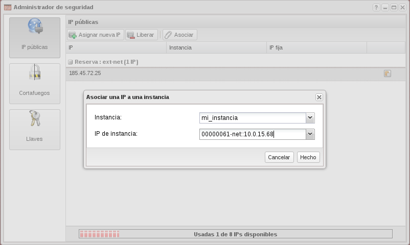
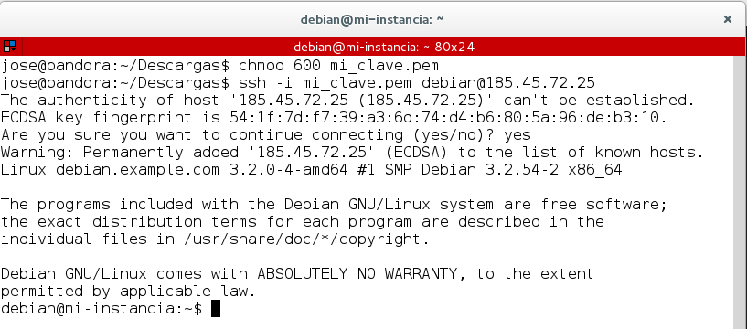

## Crear una instancia a partir de una imagen

El objetivo de esta sección es mostrar es la creación de una instancia GNU/Linux
a partir de una de las imágenes disponibles. Para ello accedemos al apartado
**Administrador de Servidores** > **Crear instancia** y a continuación tenemos
que indicar los siguientes datos:

* El primer panel es utilizado para indicar el tipo de instancia y la imagen que
se aplicarán al servidor. Los valores a introducir son:
  * Nombre : El nombre que pondremos al servidor virtual o instancia.
  * Tipo de Fuente : Indica si vamos a crear el servidor a partir de una
  imagen (*image*), una instantánea (*snapshot*) o un volumen (*volume*). En
  este caso será a partir de una imagen, veremos el resto de casos más
  adelante.
  * Fuente : Indicamos la imagen virtual, la instantánea o el volumen concreto
  que queremos utilizar para instalar el sistema operativo de nuestro
  servidor. Las características de la fuente se muestran en la parte central
  del panel.
  * Tipo de Instancia : Se debe elegir el nombre del tipo de instancia o sabor a
  aplicar en la creación, las características del sabor elegido se muestran en 
  el mismo panel en la parte central.

* En el segundo panel se indican las redes a las cuales queremos que pertenezca
nuestro servidor, es decir donde nuestro servidor virtual tendrá una IP fija.

* En el Tercer panel se gestionan temas de seguridad. Los datos a indicar son:
  * Clave Pública: Se selecciona una clave pública de una lista de claves
  públicas creadas previamente en el Administrador de Seguridad. 
  * Se selecciona uno o más grupos de seguridad para aplicar en el servidor a la
  hora de gestionar el tráfico en la red.

* De forma general no es necesario indicar nada en los dos paneles adicionales
"Información de usuario" y "Metadata" por lo que ya es posible pulsar el botón
"Terminar" y al cabo de unos segundos podemos ver que nuestra instancia ha
sido creada, que tiene asignada una IP fija:

* Por último, para poder acceder a la instancia desde el exterior tenemos que
asignar a la instancia una IP flotante, una IP Pública, para ello:
  * Elegimos la opción **IP públicas** en el apartado **Administrador de
  seguridad** y asignamos una nueva IP. 
  * Desde esa misma pantalla o desde la **Adminstración de servidores**,
  asignamos esa nueva IP a la instancia que acabamos de crear.

	

* Recuerda que una vez que la IP pública no esté asignada a una instancia se
puede liberar.
* El último paso es simplemente acceder a la instancia utilizando la clave 
privada correspondiente a la clave pública que se ha inyectado en la
instancia:

	
