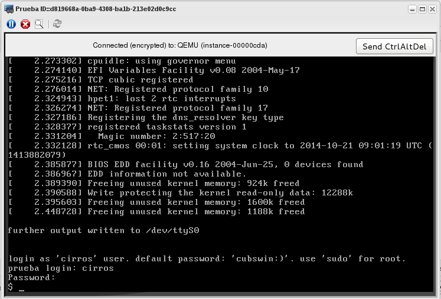

Un usuario puede poner una instancia en modo de rescate cuando el
sistema no sea accesible o no esté correctamente configurado, de esta
forma se puede acceder al servidor y corregir los errores que
hubiera.

Cuando se pone una instancia en modo rescate no se puede acceder a
ella hasta que este cambia de ACTIVE a RESCUE, proceso que puede ser
en ocasiones un poco lento.

El proceso que ocurre cuando un usuario pone una instancia en modo
rescate es el siguiente:

* La instancia inicial se apaga.
* Se crea una nueva instancia con dos discos virtuales:
  * El primer disco se crea partiendo de una imagen preconfigurada
  como imagen para rescate.
  * El segundo disco contiene el sistema raíz que se quiere rescatar.

En el caso del sistema que estamos utilizando, el sistema de rescate
que se utiliza en un Debian GNU/Linux con usuario "root" y contraseña
"stackops".
 
Después de resolver los problemas de un servidor en modo rescate, se
puede detener este modo. Cuando se detiene el rescate del servidor, la
instancia reparada se vuelve a su estado original.

### Enlaces de interés

[Tutorial - Cómo rescatar un servidor fallido con las instancias de recuperación de StackOps ](https://www.youtube.com/watch?v=gTQaES8ri-Q)