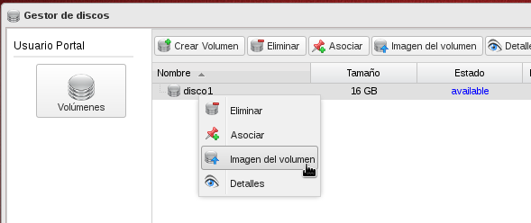
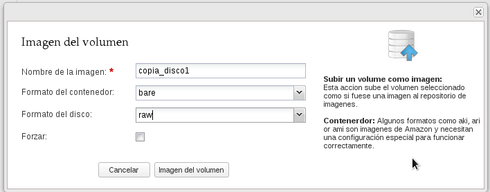
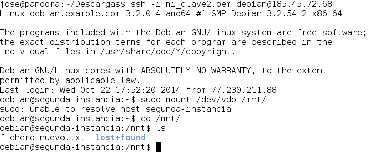

Al igual que podemos hacer instantáneas de nuestras instancias para
posteriormente crear nuevas instancias a partir de esa copia, podemos
hacer del mismo modo instantáneas de nuestro volúmenes, y crear nuevos
volúmenes a partir de copias que hemos hecho anteriormente.

En esta demostración vamos a realizar cambios sobre un volumen
asociado a una instancia, le vamos a hacer una instantánea, y
posteriormente vamos a comprobar que un volumen creado a partir de la
instantánea conserva la misma información. Vamos a realizar los
siguientes pasos: 

1. Partimos de un escenario donde tenemos corriendo una instancia
que tiene asociado un volumen de 16GiB (/dev/vdb). Vamos a formatear
el volumen con el sistema de ficheros xfs, lo vamos a montar y vamos a
crear un fichero en él.

    <pre>
    [root@test ~]# lsblk
    NAME   MAJ:MIN RM SIZE RO TYPE MOUNTPOINT
    vda    253:0    0  10G  0 disk 
    └─vda1 253:1    0  10G  0 part /
    vdb    253:16   0  16G  0 disk
    </pre>    

    <pre>
    [root@test ~]# mkfs.xfs -f /dev/vdb
    meta-data=/dev/vdb               isize=256    agcount=4, agsize=1048576 blks
             =                       sectsz=512   attr=2, projid32bit=1
             =                       crc=0
    data     =                       bsize=4096   blocks=4194304, imaxpct=25
             =                       sunit=0      swidth=0 blks
    naming   =version 2              bsize=4096   ascii-ci=0 ftype=0
    log      =internal log           bsize=4096   blocks=2560, version=2
             =                       sectsz=512   sunit=0 blks, lazy-count=1
    realtime =none                   extsz=4096   blocks=0, rtextents=0
    </pre>    
    

    <pre>
    [root@test ~]# mount /dev/vdb /mnt/
    [root@test ~]# touch /mnt/fichero_nuevo.txt
    [root@test ~]# ls -l /mnt/
    total 0
    -rw-r--r--. 1 root root 0 Mar 17 08:16 fichero_nuevo.txt
    </pre>

2. Desmontamos el volumen, desasociamos el volumen de la instancia y
creamos una instantánea del mismo con la opción **Imagen del volumen**
en el **Gestor de discos**: 

   

  

  Se mostrará un formulario donde el usuario deberá proporcionar la
siguiente información:

  * Nombre de la imagen: Parámetro obligatorio. Proporcionamos el
  nombre que le daremos a la nueva imagen.
  * Formato del contenedor: De la lista que se muestra podemos
  seleccionar:
    * aki: Indica que se almacena una imagen kernel como las
    utilizadas en Amazon EC2.
    * ari: Indica que se almacena una imagen de un disco ram como las
    utilizadas en Amazon EC2.
    * ami: Indica que se almacena una imagen de máquina virtual como
    las utilizadas en Amazon EC2.
    * bare: Indica que no existe un contenedor o metadata
    * ovf: Formato de contenedor OVF.
  * Formato del disco: De la lista que se muestra podemos indicar el
  formato de disco. Los formatos disponibles son:
    * qcow2 : Soportado por el emulador QEMU que puede expandirse de
  forma dinámica y soportar copiar al escribir (copy-on-write). 
    * raw : Un formato de imagen de disco desestructurado, si se tiene
    un fichero sin extensión entonces probablemente se trate de un
    formato raw.
    * iso : Un formato de archivo para datos contenidos en un disco
    óptico, como por ejemplo un CD-ROM.
    * vmdk : Formato de disco común, soportado por muchos monitores de
    servidores virtuales. 
    * aki : Una imagen kernel de Amazon.
    * ami : Una imagen de máquina Amazon.
    * ari : Indica que se almacena una imagen de un disco ram de amazon.
    * vhd : Formato de disco VHD, usado usualmente por monitores de
    máquinas virtuales VMWare, Xen, Microsoft, VirtualBox, entre otros. 
    * vdi : Formato de disco soportado por monitores de máquinas
    virtuales virutalBox y emuladores QEMU 
  * Forzar : Indicamos que si queremos que se fuerce la creación de la imagen.

  

3. Podemos observar en **Catálogo de imágenes** encontramos una nueva imagen de volumen, que podremos utilizar posteriormente para crear nuevos discos.

  

4. Como hemos dicho creamos un nuevo disco a partir de esta imagen.

  

5. Y asociamos este nuevo disco a otra instancia que tenemos corriendo con Linux Debian.

  

6. Por último montamos ese nuevo disco en la nueva instancia, y comprobamos que las modificaciones que habíamos hecho en el disco anterior se conserva en este nuevo.

  