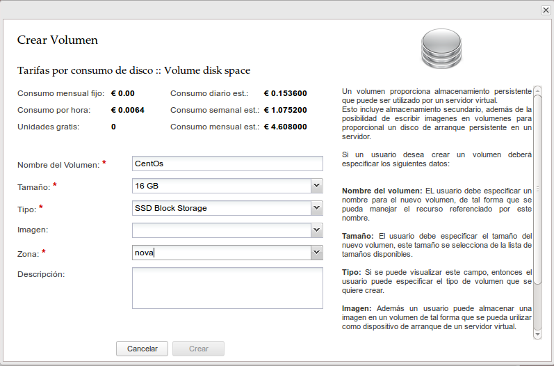
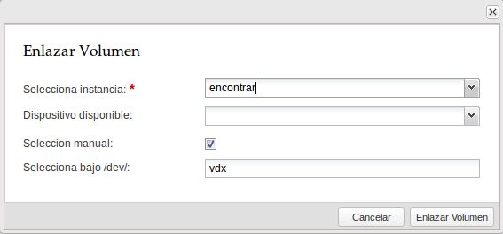

### Creación de volúmenes

Podemos definir un volumen como un dispositivo de bloques que se puede asociar y desasociar de una instancia cuando se desee. Se puede usar para proporcionar almacenamiento permanente o independiente de la vida de una instancia. 

Los pasos para crear un nuevo volumen son los siguientes:

Accedemos al apartado *Gestor de discos* y a la opción *Crear Volumen*:

	

A continuación hay que  introducir la siguiente información:

	* Nombre del Volumen: Proporcionamos el nombre que queremos asignar a nuestro volumen.
    * Tamaño: Indicamos el tamaño en gigabytes que tendrá el nuevo disco.
    * Tipo: De la lista desplegable indicamos de qué tipo será el volumen a crear. Por ejemplo si queremos que sea tipo SATA, SSD, entre otros.
    * Imagen: Parámetro opcional. Este campo se indica si se quiere crear un disco de arranque que contendrá la configuración de la imagen indicada.
    * Descripción: Parámetro opcional. Una breve descripción acerca del disco.

    Si el volumen no está asociado a una instancia lo podemos eliminar.

### Asociar un volumen a una instancia

Esta acción sirve para proporcionar almacenamiento secundario (extra) a una instancia. Para realizar la asociación podemos presionar del menú superior el botón de *Asociar*.
    
A continuación se mostrará un formulario donde indicaremos la siguiente información:

    * Selecciona instancia: Parámetro obligatorio. Se muestra una lista con las instancias existentes. 
    * Dispositivo disponible: Dentro del sistema de fichero indica el path que le corresponderá al volumen.
    * Selección manual: Si de la lista que se muestra en Dispositivo disponible no queremos colocar el volumen en ninguno de los path proporcionados podemos indicar el path donde queremos colocarlo. Al seleccionar esta opción se habilitará el campo de Selecciona bajo /dev/.
    * Selecciona bajo /dev/: En este campo indicamos el path que le corresponderá al volumen dentro del servidor virtual. Por ejemplo si introducimos vdx, nuestro volumen corresponderá a /dev/vdx.

Asociar un volumen de los dispositivos disponibles

Asociar un volumen manualmente

