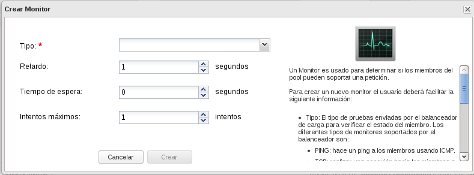

## Balanceador de carga

El balanceador de carga proporciona un servicio para dividir de manera equitativa, a través de un algoritmo, el tráfico recibido en servidores virtuales que atienden una aplicación. En este ejemplo vamos a partir de una infraestructura de dos servidores web y vamos a crear un balanceador de carga que nos posibilite repartir las peticiones entre los dos servidores.

### Configuración del balanceador de carga

Para acceder a la configuración del balanceador de carga escogemos la opción **Load Balancer**. Lo primero que tenemos que hacer es la creación de un **Pool**. Un pool es un conjunto de miembros, tales como servidores web donde se recibe y procesa el tráfico. La información que tenemo que configurar es la siguiente:

#### Información básica:

* Nombre: Elegimos un nombre que nos ayude a referenciar el balanceador.
* Subred: Del combo desplegable el usuario deberá seleccionar una subred en la que estarán todos los miembros del pool, es decir que la dirección fija de cada miembro pertenecerá a esta subred.
* Protocolo: Seleccionamos el protocolo que soportará este pool. Los protocolos actualmente soportados son TCP, HTTP y HTTPS.
* Método de balanceo: Este es el algorítmo usado para distribuir la carga (peticiones o conexiones) entre los distintos miembros del pool.
	* Round Robin : Con este algoritmo se reparten las peticiones equitativamente entre cada miembro sin tener en cuenta el estado ni carga de los servidores.
	* Least Connections : Con este algoritmo se reparten las peticiones a los miembros con menos conexiones activas.
* Descripción : Aquí el usuario puede introducir una breve explicación del funcionamiento del pool.

#### Monitores

Un **monitor** determina si un miembro back-end del pool puede procesar una petición o no.
Para que un miembro este activo, cada uno de los monitores del pool deberá declararlo como activo.

Podemos tener varios monitores disponibles y entre ellos escoger los que queremos tener habilitados.

Al crear un monitor hay que indicar la siguiente información:

* Tipo: En este combo se muestra los distintos tipos de monitores soportados.
	* PING: Realiza un ping a los miembros haciendo uso de ICMP.
	* TCP: Realiza conexiones a los miembros utilizando TCP.
	* HTTP: Envía una petición HTTP a cada miembro.
	* HTTPS: Envía una petición segura HTTP a cada miembro.
* Retardo: Segundos de diferencia entre el envío de pruebas a los miembros.
* Tiempo de espera: El número máximo de segundos que un monitor esperará para que se establezca la conexión antes de que aborte la conexión. Este valor debe ser menor que el retardo.
* Intentos máximos: Con este valor se especifica el número de conexiones fallidas que se pueden producir antes de cambiar el estado de un miembro a INACTIVE.

