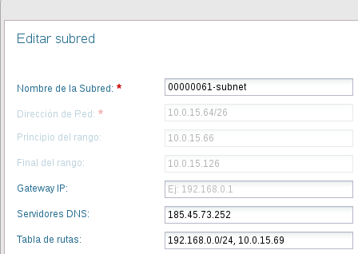

### Añadir rutas de encaminamiento

Cómo indicabamos anteriormente, hay que modificar las características de la subred de la primera red 00000061-net para que el servidor dhcp mande una ruta a las instancias conectadas a la red para que sean capaces de conectarse a las instancias de la segunda red.

Desde cirrusflex:

Con el cliente *neutron*:

	neutron subnet-update 00000061-subnet --host_routes type=dict list=true destination=192.168.0.0/24,nexthop=10.0.15.69

### Creación de instancias en las redes

Ya podemos crear las intancias en las dos redes, y podemos comprobar que la instancia conectada a la nueva red tiene una nueva regla de encaminamiento:

	debian@instancia1:~$ sudo route -n
	Kernel IP routing table
	Destination     Gateway         Genmask         Flags Metric Ref    Use Iface
	0.0.0.0         10.0.15.65      0.0.0.0         UG    0      0        0 eth0
	10.0.15.64      0.0.0.0         255.255.255.192 U     0      0        0 eth0
	192.168.0.0     10.0.15.69      255.255.255.0   UG    0      0        0 eth0

Por lo tanto podemos comprobar la conectividad entre las dos instancias:

	debian@instancia1:~$ ping 192.168.0.2
	PING 192.168.0.2 (192.168.0.2) 56(84) bytes of data.
	64 bytes from 192.168.0.2: icmp_req=1 ttl=63 time=1.93 ms
	64 bytes from 192.168.0.2: icmp_req=2 ttl=63 time=0.809 ms

### Asignación de IP flotante a la segunda instancia

¿Qué sucede si intentamos asignar una ip flotante a la segunda instancia? La segunda instancia no está conectada directamente a la red externa por un router, por lo tanto no se pueden crear las reglas NAT necesarias en la asignación de la IP flotante, y por tanto está operación nos devuelve un error:

### Accediendo a la segunda instancia

La única forma de acceder a la segunda instancia es desde la primera, pero para ello necesitamos nuestra clave privada en la primera instancia, por lo tanto vamos a copiar nuestro fichero pem a la primera instancia:

	$ scp -i mi_clave.pem mi_clave.pem debian@185.45.74.34:/home/debian

 y a continuación accedemos a la primera instancia y usaremos el la clave privada para acceder a la segunda:

 	debian@instancia1:~$ chmod 400 mi_clave.pem 
	debian@instancia1:~$ ssh -i mi_clave.pem debian@192.168.0.2

y por último comprobamos que desde la segunda instancia tenemos conectividad con la primera:

	debian@instancia2:~$ ping 10.0.15.68
	PING 10.0.15.68 (10.0.15.68) 56(84) bytes of data.
	64 bytes from 10.0.15.68: icmp_req=1 ttl=63 time=1.12 ms
	64 bytes from 10.0.15.68: icmp_req=2 ttl=63 time=0.703 ms

